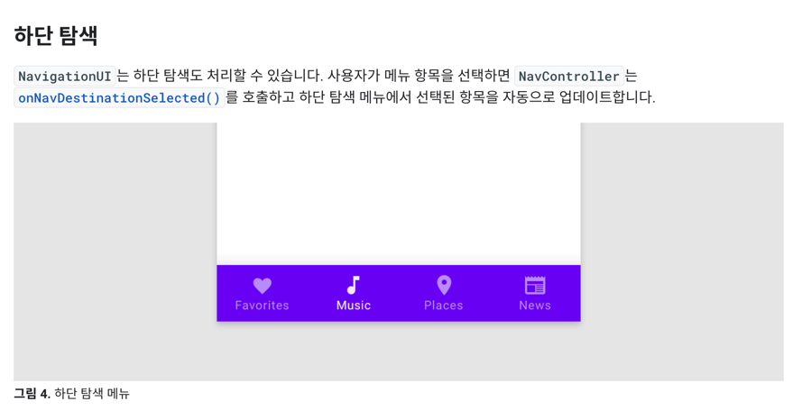

# InteriorMaestro

Firebase Auth, Firestore, Firebase Storage, Navigation, Dark Theme

## [Navigation](https://developer.android.com/guide/navigation/navigation-getting-started)

https://github.com/YiBeomSeok/TIL/blob/main/Android/Navigation.md

```groovy
  def nav_version = "2.5.3"

// Kotlin
implementation "androidx.navigation:navigation-fragment-ktx:$nav_version"
implementation "androidx.navigation:navigation-ui-ktx:$nav_version"
```

### Safe Args를 사용하여 유형 안전성 보장

> 대상 간 이동을 위해 Safe Args Gradle 플러그인을 사용하는 것이 좋습니다.
>
> 이 플러그인은 대상 간 유형 안전 탐색 및 인수 전달을 사용 설정하는 간단한 객체 및 빌더 클래스를 생성합니다.

### findNavController.navigate

예시

```kotlin
private fun createUserWithEmailAndPassword(email: String, password: String) {
    Firebase.auth.createUserWithEmailAndPassword(email, password)
        .addOnCompleteListener { task ->
            if (task.isSuccessful) {
                showSnackbar(R.string.guid_sign_up_success)

                val action = AuthFragmentDirections.actionAuthFragmentToHomeFragment()
                findNavController().navigate(action)

                initViewsToSignInState()
            } else {
                showSnackbar(R.string.guid_fail_sign_up)
            }
        }
}
```

### NavigationUI로 UI 구성요소 업데이트


https://developer.android.com/guide/navigation/navigation-ui?hl=ko#bottom_navigation

#### 메뉴 항목에 대상 연결

>
> NavigationUI는 대상을 메뉴 기반 UI 구성요소에 연결하기 위한 도우미도 제공합니다.
>
> NavigationUI에는 연결된 대상을 호스팅하는 NavController와 함께 MenuItem을 받는 도우미 메서드 onNavDestinationSelected()가
> 포함되어 있습니다.
>
> MenuItem의 id가 대상의 id와 일치하면 NavController가 그 대상으로 이동할 수 있습니다.

-> `nav_graph`의 id와 `menu`의 `item`의 id가 같으면 자동으로 연결이 된다

```xml
<?xml version="1.0" encoding="utf-8"?>
<navigation xmlns:android="http://schemas.android.com/apk/res/android"
    xmlns:app="http://schemas.android.com/apk/res-auto"
    xmlns:tools="http://schemas.android.com/tools"
    android:id="@+id/nav_graph"
    app:startDestination="@id/authFragment">

    <fragment
        android:id="@+id/homeFragment"
        android:name="org.bmsk.interiormaestro.HomeFragment"
        android:label="HomeFragment"
        tools:layout="@layout/fragment_home" />
    <fragment
        android:id="@+id/authFragment"
        android:name="org.bmsk.interiormaestro.AuthFragment"
        android:label="AuthFragment"
        tools:layout="@layout/fragment_auth">
    </fragment>
</navigation>
```

```xml
<menu xmlns:android="http://schemas.android.com/apk/res/android">

    <item
        android:id="@+id/homeFragment" nav_graph의 id와 같도록 설정
        android:icon="@drawable/baseline_home_24"
        android:title="@string/home"/>
    <item
        android:id="@+id/authFragment" nav_graph의 id와 같도록 설정
        android:icon="@drawable/baseline_person_24"
        android:title="@string/my_info"/>
</menu>
```